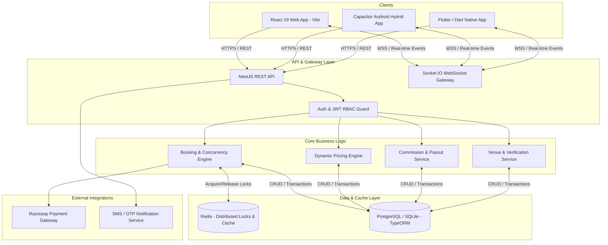

# 🏟️ Arena — Real-Time Sports Venue Discovery & Reservation Platform

[](https://react.dev/)
[](https://nestjs.com/)
[](https://www.typescriptlang.org/)
[](https://flutter.dev/)
[](https://redis.io/)
[](https://www.postgresql.org/)
[](https://razorpay.com/)
[](https://capacitorjs.com/)

---

## 📌 Executive Summary

**Arena** is an enterprise-grade, high-concurrency sports venue discovery and real-time turf reservation ecosystem. Engineered for scalability, reliability, and friction-free user experiences, Arena solves the critical industry challenge of **slot contention and double-booking** during peak demand hours.

The platform provides a unified digital experience across **Web (React 19 + Vite)**, **Hybrid Mobile (Capacitor Android)**, and **Native Mobile (Flutter & Dart)**, backed by a robust **NestJS + TypeScript micro-modular backend** with Redis-powered distributed locks, WebSocket event streaming, and automated multi-party escrow/commission settlement.

---

## 🌟 Key Highlights & Engineering Achievements

* ⚡ **Zero Double-Booking Guarantee**: Implemented distributed Redis mutex locks with automatic TTL expiration to handle high-concurrency slot reservations under sub-second latency.
* 🔄 **Real-Time WebSocket Synchronization**: Instant bi-directional state broadcast using Socket.IO to immediately notify all active users when slots are held, confirmed, or released.
* 👥 **Three-Tier Role-Based Access Control (RBAC)**: Custom distinct flows and security boundaries for **Players**, **Venue Owners / Turf Managers**, and **Platform Super Admins**.
* 💰 **Dynamic Dynamic Pricing & Revenue Engine**: Automated rule engine for peak-hour pricing, weekend surcharges, seasonal discounts, and automated platform commission split calculation.
* 📱 **Cross-Platform Architecture**: Unified business logic serving React Web, Android APK via Capacitor, and Flutter native modules with responsive design systems.
* 🛡️ **Enterprise Security**: 2-Factor Authentication (2FA), JWT-based stateless session management, encrypted password hashing (bcrypt), and secure Razorpay payment signature verification.

---

## 🧪 Testing & Evaluation Guide (For Recruiters & Evaluators)

To allow recruiters, hiring managers, and evaluators to quickly and comprehensively test all facets of the application, Arena includes built-in test personas, demo credentials, and a multi-role selector.

### 🔑 Demo Credentials & Test Personas

| Role | Test Username / Email / Mobile | Password / OTP | Key Workflows to Test |
|---|---|---|---|
| **🏃 Player / Athlete** | Any 10-digit mobile (e.g. `9876543210`) | OTP: `123456` | Venue discovery, sport filters, 10-minute temporary slot lock, simulated Razorpay checkout, booking pass QR, reviews & ratings. |
| **🏟️ Venue Owner** | `9876543210` (Apex Sports) or `9812345678` | OTP: `123456` | KYC verification, court creation, peak/off-peak pricing matrix, slot availability controls, revenue analytics & payouts. |
| **🛡️ Super Admin** | `admin@arena.com` | Password: `Admin@Arena2026!`<br>2FA Code: `849201` *(or universal demo bypass `123456`)* | 2FA verification, venue KYC approval pipeline, platform commission %, user moderation, system-wide GMV analytics. |

---

### 🕹️ Interactive Click-by-Click Evaluation Scenarios

#### Scenario 1: The Player Reservation Journey (Concurrency & Checkout)
1. Launch the app (`npm run dev`) and select **"Player"** from the Role Selection screen.
2. Enter your mobile number and submit the demo OTP `123456`.
3. On the **Home Screen**, browse featured sports (Football, Cricket, Badminton, Tennis).
4. Tap **Filter** to test amenities (Floodlights, Locker Rooms, Parking) and distance radius.
5. Select a venue (e.g. *Apex Turf Arena*), choose a date from the horizontal date picker, and pick a time slot.
6. Observe the **10-Minute Lock Screen** with real-time countdown timer ensuring no double bookings.
7. Proceed to **Booking Summary**, apply a promo code, and choose **Razorpay Gateway** or **Wallet**.
8. Complete payment to receive your instant **QR-coded Booking Pass**.
9. Access **"My Bookings"** to view upcoming/past games and test submitting post-match **Reviews & Ratings**.

#### Scenario 2: The Venue Owner Dashboard & Pricing Engine
1. Return to the Role Selector and choose **"Venue Owner"**.
2. Log in using `9876543210` (OTP: `123456`).
3. **Business Verification (KYC)**: View the submitted business license & GST details.
4. **Court & Turf Management**: Configure court surfaces (Artificial Grass, Wooden, Synthetic), dimensions, and sport mappings.
5. **Pricing Configurator**: Adjust weekday vs. weekend multipliers and peak-hour surge rules (6:00 PM – 11:00 PM).
6. **Slot Availability & Maintenance**: Block out specific slots for maintenance and verify that players immediately see them as unavailable.
7. **Earnings & Settlements**: Inspect the financial ledger displaying gross revenue, platform commission deductions, and pending payouts.

#### Scenario 3: The Super Admin Control Center & Platform Governance
1. Choose **"Super Admin"** on the Role Selector.
2. Enter `admin@arena.com` with password `Admin@Arena2026!`.
3. Submit the 2FA OTP `849201` on the secure verification screen.
4. **Venue Approval Queue**: Inspect newly submitted turf applications, view attached KYC documents, and test approving/rejecting with reviewer feedback.
5. **Commission Settings**: Modify platform commission rates (e.g. 10%) and observe automatic split calculations across future bookings.
6. **User Moderation & Security Audit Log**: Review audit entries tracking administrative actions, 2FA logins, and session lifecycles.

---

### 🤖 Automated Concurrency & Anti-Double-Booking Tests

Arena includes a dedicated concurrency test harness simulating 10 simultaneous high-speed booking attempts on the exact same court and time slot.

```bash
# Navigate to the backend directory
cd server

# Run the automated concurrency & anti-double-booking test
npm run test -- concurrent-booking.spec.ts
```

**Expected Result:**
* ✅ **1 Request**: Successfully acquires the atomic lock and transitions to `HELD` / `CONFIRMED`.
* ❌ **9 Requests**: Gracefully rejected with `409 Conflict` (`"This slot is currently being held or already reserved by another player."`).

---

## 🏛️ System Architecture



---

## 🚀 Role-by-Role Feature Matrix

### 1. 🏃‍♂️ Player Experience (Consumer Portal)
* **Smart Venue Discovery**: Search and filter turfs by sport (Football, Cricket, Badminton, Tennis, Pickleball), geo-radius, pricing range, ratings, and specific amenities (Floodlights, Locker rooms, Parking).
* **Interactive Slot Matrix**: Live calendar view displaying available, locked, and booked time slots with visual peak-hour indicators.
* **Frictionless Booking & Lock Engine**: 10-minute temporary slot hold with countdown timer to prevent race conditions during payment processing.
* **Integrated Payments & Wallet**: Instant checkout via Razorpay (UPI, Credit/Debit Cards, Net Banking) or platform Wallet with cashback/referral rewards.
* **Social & Group Bookings**: Invite friends, split booking fees, and share instant booking QR passes.
* **Ratings & Verified Reviews**: Post-match review submission with photo attachments and rating aggregation.

### 2. 🏟️ Venue Owner & Turf Manager Dashboard
* **Business Onboarding & Verification**: Multi-step KYC verification, document uploads (GST, Business registration), and bank account setup for direct payouts.
* **Court & Turf Management**: Configure individual courts, surface types (Artificial Turf, Wooden, Clay), lighting schedules, and sport compatibilities.
* **Custom Dynamic Pricing Matrix**: Set custom base hourly rates, morning/evening surge multipliers, and custom holiday pricing schedules.
* **Staff & Ground Manager Delegation**: Role management allowing staff to check-in players via QR scan without exposing financial analytics.
* **Real-Time Earnings & Settlement Analytics**: Track gross revenue, commission deductions, pending payouts, and detailed booking reports.
* **Slot Blockout & Maintenance Management**: Manual slot blocking for private tournaments or turf maintenance.

### 3. 🛡️ Super Admin Control Center
* **2FA Protected Master Control**: Two-Factor Authentication protected administrative console.
* **Venue Approval Pipeline**: Review submitted venue applications, verify business credentials, and approve/reject with detailed feedback.
* **Financial Oversight & Commission Rules**: Global and per-venue commission percentage configuration with automatic fee split calculations.
* **Platform User & Owner Moderation**: Search, suspend, or audit players and owners with complete audit logs.
* **Support Ticket Resolution System**: Centralized helpdesk with live status tracking, ticket assignment, and customer dispute resolution.
* **System-Wide Business Analytics**: Live metrics on total GMV (Gross Merchandise Value), booking conversion rates, peak usage times, and churn.

---

## 🛠️ Technology Stack

| Layer | Technologies |
|---|---|
| **Frontend (Web & Hybrid)** | React 19, Vite, Modern CSS Design System, Lucide React Icons |
| **Mobile Runtime** | Capacitor Android 8, Native Android Wrapper, Flutter 3 (Dart) |
| **Backend Framework** | NestJS 10 (TypeScript), Node.js, Express |
| **Concurrency & Caching** | Redis, ioredis (Distributed Mutex Locks, TTL Key Expirations) |
| **Database & ORM** | PostgreSQL / SQLite, TypeORM (Migrations, Relations, Transactions) |
| **Real-Time Communication** | Socket.IO, WebSocket Gateways (`@nestjs/websockets`) |
| **Security & Authentication**| Passport.js, JWT, bcrypt, Role Guards, Helmet, CORS |
| **Payments** | Razorpay SDK, Webhook Handlers, Cryptographic Signature Validation |
| **Testing & Quality** | Jest, Supertest, Concurrent Concurrency Unit Tests, Oxlint, ESLint |

---

## 📁 Repository Structure

```text
Arena/
├── src/                          # React 19 Frontend Application
│   ├── components/               # UI Screens (Player, Owner, Admin Portals)
│   │   ├── Admin*.jsx            # Super Admin Control Center Screens
│   │   ├── Owner*.jsx            # Venue Owner Management Screens
│   │   ├── Player*.jsx           # Player Discovery & Booking Screens
│   │   └── ...                   # Shared Modals, Frames, Navigation
│   ├── services/                 # API client services & state managers
│   ├── data/                     # Mock data sets and seed services
│   ├── types/                    # Core domain models & interfaces
│   ├── App.jsx                   # Central Application Router & State Container
│   └── index.css                 # Comprehensive CSS Design System & Theme Tokens
│
├── server/                       # NestJS Enterprise Backend Application
│   ├── src/
│   │   ├── database/entities/    # TypeORM Entities (Booking, Slot, Venue, User, Owner)
│   │   ├── modules/
│   │   │   ├── auth/             # JWT, 2FA & Authentication Module
│   │   │   ├── booking/          # Redis Locking, Pricing & Razorpay Engine
│   │   │   ├── venues/           # Venue Discovery & Management Module
│   │   │   ├── owners/           # Owner KYC, Payout & Availability Module
│   │   │   └── admin/            # Admin Reporting & Moderation Module
│   │   └── common/               # Enums, DTOs, Guards, Decorators
│   ├── package.json              # Backend Dependencies & Scripts
│   └── tsconfig.json             # TypeScript Compiler Configuration
│
├── lib/                          # Flutter & Dart Native Mobile Module
│   ├── models/                   # Dart Data Models
│   ├── screens/                  # Flutter Screen Views (Venue Detail, Booking)
│   ├── services/                 # Dart API Services
│   ├── theme/                    # Arena Dart Color & Component Themes
│   ├── widgets/                  # Reusable Flutter UI Components
│   └── main.dart                 # Flutter Application Entry Point
│
├── android/                      # Native Android & Capacitor Project Files
├── public/                       # Static Assets & Icons
├── capacitor.config.json         # Capacitor Mobile Runtime Configuration
├── package.json                  # Root Frontend Package Configuration
└── vite.config.js                # Vite Bundler & Dev Server Setup
```

---

## ⚙️ Local Development & Setup Guide

### 1. Prerequisites
Ensure you have the following installed on your workstation:
* **Node.js**: `v18.x` or `v20.x` LTS
* **npm** or **yarn**
* **Redis Server** (Local or cloud instance like Redis Cloud / Upstash)
* **PostgreSQL** or **SQLite3**
* *(Optional for mobile development)* **Android Studio** & **Flutter SDK**

---

### 2. Frontend Setup (React 19 + Vite)
```bash
# Clone the repository
git clone https://github.com/Shrushti-cse1111/Arena-Real-Time-Sports-Venue-Discovery-Reservation-Platform-.git
cd Arena-Real-Time-Sports-Venue-Discovery-Reservation-Platform-

# Install root dependencies
npm install

# Start the Vite development server
npm run dev
```
The web application will be accessible at: `http://localhost:5173`

---

### 3. Backend Setup (NestJS + TypeScript)
```bash
# Navigate to the server folder
cd server

# Install backend dependencies
npm install

# Configure environment variables
cp .env.example .env

# Run database migrations / seed initial data
npm run seed

# Start NestJS backend in development mode
npm run start:dev
```
The REST API will be available at `http://localhost:3000` (Swagger Documentation at `http://localhost:3000/api`).

---

### 4. Running Capacitor Android Build
```bash
# Build frontend web assets
npm run build

# Sync assets to native Android project
npm run cap:sync

# Open project in Android Studio
npm run cap:open
```

---

### 5. Running Native Flutter Module
```bash
# Get Flutter dependencies
flutter pub get

# Run on connected device or emulator
flutter run
```

---

## 🧪 Testing & Code Quality

* **Unit & E2E Testing**:
  ```bash
  cd server
  npm run test                  # Run unit tests
  npm run test:e2e              # Run end-to-end integration tests
  npm run test:cov              # Generate code coverage report
  ```
* **Linting & Code Formatting**:
  ```bash
  npm run lint                  # Fast linting with Oxlint
  cd server && npm run lint     # ESLint on backend TypeScript
  ```

---

## 🔒 Concurrency & Slot Locking Workflow

1. **User Selects Slot**: Client requests a temporary lock for `venue_id` + `slot_id` + `date`.
2. **Redis Atomic Lock**: Backend attempts `SET key value NX EX 600` (10-minute hold).
   * **If Success**: Slot state changes to `LOCKED`; WebSocket emits event to all connected clients.
   * **If Failure**: User receives immediate feedback that the slot is currently being reserved by another user.
3. **Payment Confirmation**: Upon Razorpay webhook verification, the slot state transitions permanently to `CONFIRMED` in PostgreSQL, and the Redis lock is released.
4. **Lock Expiration / Abandonment**: If payment is not completed within 10 minutes, the Redis TTL expires and scheduled worker releases the slot back to `AVAILABLE`.

---

## 👤 Author & Contact

**Shrushti Angadi**
* **GitHub**: [@Shrushti-cse1111](https://github.com/Shrushti-cse1111)
* **Project Repository**: [Arena-Real-Time-Sports-Venue-Discovery-Reservation-Platform-](https://github.com/Shrushti-cse1111/Arena-Real-Time-Sports-Venue-Discovery-Reservation-Platform-)

---

## 📄 License
This project is licensed under the terms described in the [LICENSE](LICENSE) file.
